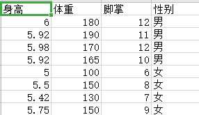
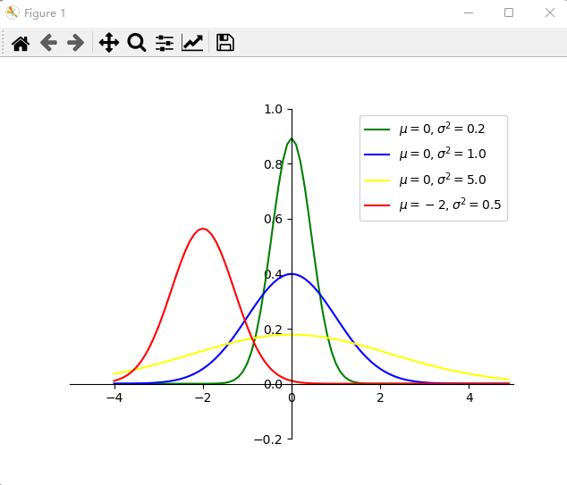
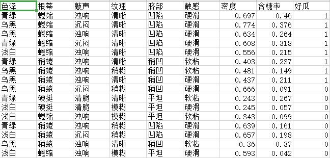

# Naive Bayes

## Introduction:

​		贝叶斯定理由英国数学家贝叶斯 ( Thomas Bayes 1702-1761 ) 发展，用来描述两个条件[概率](https://baike.baidu.com/item/概率?fromModule=lemma_inlink)之间的关系。假设现在我们有两个事件A和B

$$
P(A|B)=\frac {P(A,B)} {P(B)}
$$


$$
P(B|A)=\frac {P(A,B)}{P(A)}=\frac {P(A|B)*P(B)}{P(A)}
$$

由加法公式可得：

$$
P(A)=ΣP(A|X_i)_{(X表示一个事件集合中所有的与A相关的但是非A事件集合，X_i表示X集合中的一个元素)}
$$

那么我们的:

$$
P(B|A)=\frac {P(A,B)}{P(A)}=\frac {P(A|B)*P(B)}{ΣP(A|X_i)}
$$

## Derivation：

### Conditional probability:

​			首先我们来介绍一下条件概率，条件概率这个东西很简单啊。举一个简单的例子，就比如今天买一朵玫瑰花的概率是P(A),<sub>(A表示今天我买玫瑰花这一个事件)</sub>,那么在我买了一朵玫瑰花的条件下，我还会再买一朵玫瑰花嘛？可能会，也可能不会，但是，我们不得不承认，今天第一次买玫瑰花这一个事件确实对今天我第二次买玫瑰花产生了一定的影响，这很容易理解。因为我想如果没有特别特殊原因的话，我不会一天去买两朵玫瑰花，当然，除非我有两个女朋友，早上我去见了第一个女朋友，买了一束话，晚上又见了另一个女朋友，又买了一束花。好了，言归正转，现在我们要考虑我买第二朵玫瑰花发生的概率了，首先我们用这样一个符号来记录我们要得到的概率：

$$
P(B|A)
$$

很自然的，A代表的是我们今天第一次买玫瑰花的这个事件，B代表的是今天我们第二次买玫瑰花的这个事件。上面的值就代表的是，今天我在第一天买了玫瑰花的情况下，我们要第二次买到这个玫瑰花的概率。

### Joint prob：

​			这串英文翻译过来就是叫联合概率，那么什么是联合概率呢？其实很容易理解，就像我们上面的玫瑰花一样，假设现在通过对我好几千年的观察，发现，我一天买一朵玫瑰花的概率是:<sub>(A为我每天买玫瑰花这个事件，a为具体的实例，i代表朵数)</sub>

$$
P(A=a_1)
$$

在这几千年的观察中，观察者还发现了一个事情，就是，我每天都要买几瓶可口可乐。那么我每天买几瓶可口可乐呢？经过观察统计发现，我每天买i瓶可乐的概率为：<sub>(B为我每天买可乐这个事件，b为具体的实例，i代表瓶数)</sub>

$$
P(B=b_i)
$$

哎，这样一来，新的问题就出现了：今天我买了两朵玫瑰花，同时又买了五瓶可乐这个事情发生的概率有多大。首先这个概率值我们记做：

$$
P(A=a_2,B=b_5)
$$


### Product Rule：

​			按照我们通常的理解就是买可乐和买玫瑰花，这两个事件是毫无相干的，就像风马牛一样，不相及。也就是这两个事件的相互独立的，这个时候那么我们要的概率值就是：

$$
P(A=a_2,B=b_5)=P(A=a_2)*P(B=b_5)
$$

可是，我个人感觉这两个事件并不是毫无相干的。因为，例如我今天买了999多玫瑰花去向我的女神表白，但是被拒绝了，在回来的路上十分的抑郁，剪不断，理还乱。这个时候，突然一抬头，一辆大卡车，出现在了我的面前，欧玛噶。我见了上帝，今天是喝不到可乐了。你看买玫瑰花，和我喝多少可乐是不是还是有联系的，对吧？虽然有一些牵强，但是还是有联系的，这个时候就不能按照上面那个公式来计算了，那么我们应该怎么计算呢？还是通过观察，经过长达九九八十一千年的观察，观察者发现，我每天买两朵花的概率是P（A=a<sub>2</sub>）,在我买完两朵玫瑰花后，又买五瓶可乐的概率是P(B=b<sub>5</sub>|A=a<sub>2</sub>)那么我买玫瑰花之前，我想知道我买了两朵玫瑰花同时又买了五瓶可乐的概率就是：

$$
P(A=a_2,B=b_5)=P(B=b_5|A=a_2)*P(A=a_2)
$$

这个公式看起来可能有些抽象，但是其实没有那么难，他的本质还是两个事件的概率乘积，但是，对于两个有关联的事件，一个事件的概率会随着另一个事件的改变而改变，我们只是找到正确的概率值相乘而已。同样的，上面的公式我们找了B事件随着A事件的改变而改变的概率值，当然我们也可以尝试这找到事件A随着事件B概率的变换而变换的值，那么

$$
P(A=a_2,B=b_5)=P(B=b_5)*P(A=a_2|B=b_5)=P(B=b_5|A=a_2)*P(A=a_2)
$$

当然，对于多个事件，我们依然可以这样进行计算。假设现在我们有一个事件集合X，x<sub>i</sub>为该事件集合的具体摸一个事件，那么我们考虑多个随机事件的情况：

$$
P(X=x_1,X=x_2,X=x_3,...,X=x_i)=P(X=x_1)*P(X=x_2,X=x_3,...,X=x_i|X=x_1)
$$

$$
=P(X=x_1)*P(X=x_2|X=x_1)P(X=x_3,...,X=x_i|X=x_1,X=x_2)
$$

$$
=P(X=x_1)P(X=x_2|X=x_1)P(X=x_3,...,X=x_i|X=x_1,X=x_2)...P(X=x_i|X=x_1,...,X=x_{i-1})
$$


### Bayes:

​			有了上面的一些内容，下面我们再来想这样一件事情。假设现在我已经知道了，我在买了两朵玫瑰花的情况下又买了两瓶可乐的概率为P(B=b<sub>5</sub>|A=a<sub>2</sub>)，即：

$$
P(B=b_5|A=a_2)
$$

那么我们能不能知道我在买了五瓶可乐的情况下，买了两多玫瑰花的概率呢？就是我们想要求得：

$$
P(A=a_2|B=b_5)
$$

我想这不会太难的，根据上面我们推导的乘法规则里的第三个式子：

$$
P(A=a_2,B=b_5)=P(B=b_5)*P(A=a_2|B=b_5)=P(B=b_5|A=a_2)*P(A=a_2)
$$

不难发现：

$$
P(A=a_2|B=b_5)=\frac{P(A=a_2,B=b_5)}{P(B=b_5)}=\frac{P(B=b_5|A=a_2)*P(A=a_2)}{P(B=b_5)}
$$

我们已经知道了P(B=b<sub>5</sub>|A=a<sub>2</sub>)的值，那么我们只要求得P（A=a<sub>2</sub>)和P（B=b<sub>5</sub>）的值便可以计算出来我们想要的值。这便是贝叶斯公式，实际上它是很简单的。但是通常情况下我们碰到的情况可能要比这复杂很多。因为事务之间的联系不可能只有玫瑰花和可乐之间的联系，还有好多好多的情况。就比如我们要判断一对夫妻未来生出来的孩子长得漂亮还是不漂亮，那么我们可以参考的依据就有很多了，比如他爸爸的眼睛大小，他妈妈的眼睛大小，他爸爸的海拔，他妈妈的海拔等等有诸多的因素。所以往往我们要的这个公式是很长的：

$$
P(Y=y_i|x_1,x_2,x_3,...,x_i)=\frac{P(x_1,x_2,x_3,...,x_i|Y=y_i)*P(Y=y_i)}{P(x_1,x_2,x_3,...,x_i)}
$$

我们按照乘法规则将他们展开：

$$
P(Y=y_i|x_1,x_2,x_3,...,x_i)=\frac{P(x_1|x_2,x_3...,x_i,Y=y_i)P(x_2|x_3,x_4...,x_i,Y=y_i)...P(x_i|Y=y_i)P(Y=Y_i)}{P(x_1,x_2,x_3,...,x_i)}
$$

这样看来，这个贝叶斯公式的计算难度还是很大，因为我们无法忽略这些X=(x<sub>1</sub>，x<sub>2</sub>，...，x<sub>i</sub>)内部之间的联系，就像可能1.6m的女生要找1.8m的男性一样，这个内部纯在着某种联系，因为1.6m的女性找一个1.5m的男性说啥豆不太合适，所以P(X=x<sub>i</sub>)这样的东西是很难算出来的。那么怎么办呢？


### Naive Bayes：

​			为了解决上面的问题，我们就引出来朴素贝叶斯这个方法。所谓的朴素就是忽略掉X=(x<sub>1</sub>，x<sub>2</sub>，...，x<sub>i</sub>)内部之间的联系。也就是x<sub>1</sub>，x<sub>2</sub>，...，x<sub>i</sub>他们之间是相互独立的：

$$
P(x_1,x_2,x_3,...,x_i)=P(x_1)P(x_2)P(x_3)...P(x_i)
$$

同样的：

$$
P(x_1|x_2,x_3...,x_i,Y=y_i)=P(x_1|y_i)
$$

所以我们将贝叶斯公式变为朴素贝叶斯公式就是：

$$
P(Y=y_i|x_1,x_2,x_3,...,x_i)=\frac{P(x_1|Y=y_i)P(x_2|Y=y_i)...P(x_i|Y=y_i)P(Y=Y_i)}{P(x_1,x_2,x_3,...,x_i)}
$$

在机器学习里面，我们要判断事件Y是属于哪一个类别，我们可以分别计算出：

$$
P(Y=y_1|x_1,x_2,x_3,...,x_i)
$$

$$
P(Y=y_2|x_1,x_2,x_3,...,x_i)
$$

$$
...
$$

$$
P(Y=y_i|x_1,x_2,x_3,...,x_i)
$$


然后将他们的概率值进行比较，取概率值最大的为我们预测的结果。在计算的过程中不难发现，他们的分母都是一样的，都是P(x<sub>1</sub>，x<sub>2</sub>，...，x<sub>i</sub>)，所以其实我们只需要计算分子部分作比较就可以了，就是这一部分：

$$
P(x_1|Y=y_i)P(x_2|Y=y_i)...P(x_i|Y=y_i)P(Y=y_i)
$$

这便是我们朴素贝叶斯公式的推导全过程了。下面我们来讨论一些再计算的时候可能出现的问题。

## Data Processing:

### Continuous Value Processing:

#### Gaussian Distribution：

​			在进行处理之前，我们回想一下我们的高斯分布，也就是正态分布。第一次接触高斯分布是在高中的时候，但是那个时候，仅仅停留在这么应用高斯分布去解题，没有实际的理解过他。那个时候，给出一组数据去计算他的均值和方差，然后巴拉巴拉一大堆。至于为什么是那样没有思考过。但是在大学上概率论的时候，思考了很长时间。终于弄明白他是什么意思了。其实说白了就是大多数都是事情的发生都是在中间的，至于那些极大值或者极小值的发生都是偶然发生的。就像我们买彩票，大多数情况都是中不了奖的。但是也有极少数可以中大奖，极其极其的少数中两次以上的大奖，这个就是符合高斯分布的。所谓的分布，就是给定一个x值，可以计算出这个x值发生的概率值。大致就是这样，也许表达的不是很清楚，这个其实是一种感觉上的东西，目前还没有想到该怎么表达。下面我们给出他的公式：

$$
X\leadsto N(\mu,\sigma^2)
$$


$$
f(x)=\frac{1}{\sigma\sqrt{2\pi}}\exp^{\frac{-(x-\mu)^2}{2\sigma^2}}
$$


#### Application:

​			当我们在数据集中遇到连续值的时候，我们就认为这个连续值是符合高斯分布的。因为，万事万物基本上都符合高斯分布，其实无论是二项分布，泊松分布还是指数分布，他们的图像和高斯分布都是高度相似的。我们将连续值按照标签进行划分，将划分的每一个集合都算一个高斯分布出来。在测试集合中将数值代入该高斯分布得到的函数值就是我们要求的概率值。举一个例子，现在我们在Y=y<sub>1</sub>的条件下，有一群连续的属性值(x<sub>1</sub>，x<sub>2</sub>，...，x<sub>i</sub>)。该属性下测试样本的值为X。那么我们计算：

$$
\mu=\frac{Σx_i}{Σ\Pi(x)}
$$

$$
\sigma^2=Σ(x_i-\mu)^2
$$

这样我们认为：

$$
X\leadsto N(\mu,\sigma^2)
$$

那么：

$$
P(X|Y=y_1)=f(X)=\frac{1}{\sigma\sqrt{2\pi}}\exp^{\frac{-(X-\mu)^2}{2\sigma^2}}
$$


### Missing Value Handling:

​			在有些时候，我们的测试样本中的某一些属性值，在我们的训练样本中是没有的，那么对应这个属性值的条件概率就变成了0，假设这个属性值是X=x<sub>m</sub>,其在Y=y<sub>m</sub>下是没有的，那么：

$$
P(x_m|y_m)=0
$$

对应的：

$$
P(x_1|y_m)P(x_2|y_m)...P(x_3|y_m)...P(x_i|y_m)=0
$$


这显然是不合理的。对于这种情况，我们采用拉普拉斯平滑来解决。

#### Laplacian smoothing：

​			拉普拉斯平滑，其实也很简单。假设现在`我们有一个随机变量X，其取值范围为（1，2，3，...，i）在进行了k次观察后，其对应的实验结果为Y=(y<sub>1</sub>，y<sub>2</sub>，...，y<sub>k</sub>),那么P(Y=y<sup>m</sup>)的极大似然估计值就是：

$$
P(Y=y^m)=\frac{Σ\Pi(Y=y^m)}{k}
$$

这很容易理解，就是Y=y<sup>m</sup>的数量除以观测的次数。这个是没有做拉普拉斯平滑之前的数值，做拉普拉斯平滑之后就变成了：(α为平滑系数，通常为1)

$$
P(Y=y^m)=\frac{Σ\Pi(Y=y^m)+1*\alpha}{k+i\alpha}
$$

那怎么理解这个拉普拉斯平滑呢？说白了其实就是为了避免零概率的出现，我们在原来的分子上加1，同时为了减小分子加1对数据整体统计规律产生的影响，我们在其分母部分加上该随机变量可能的取值的个数。至于为什么，我还没有参悟。


## Result:

### Homework_1:

#### Data:



#### Analysis:


<h4>结果分析矩阵:</h4>   <!--标题-->
<table border="1" width="500px" cellspacing="10">
<tr>
  <th align="left">缩放情况\预测结果</th>
  <th align="center">P(男|X)</th>
  <th align="right">P(女|X)</th>
  <th align="right">男女概率比</th>
  <th align="right">预测结果</th>
</tr>
<tr>
  <td>未缩放</td>
  <td>0.067</td>
  <td>3.57*e-10</td>
  <td>187660347</td>
  <td>男</td>
</tr>
<tr>
  <td>缩放</th>
  <td>291.98</td>
  <td>7.47</td>
  <td>39</td>
  <td>男</td>
</tr>
</table>


##### The difference between scaled and unscaled：

​			1：从实验结果上来看，他们的预测结果都是正确的。并没有受到特征缩放的影响。分析其原因：

​						a:该数据集的数据都是连续性的数据。对于连续性的数据，我们采用高斯分布的概率密度函数来映射出一个相应的概率值。值得注意的是，这里的概率密度函数值并不是真正意义上的概率值，因为他是一个概率密度函数我们只有对于某一个区域求积分才能算得其概率。而对于某一点的概率值它总是为零的。我们只是用概率密度的函数值来代替了其概率，并不是真正的概率。

​						b:使用高斯分布的时候，我们需要求得的参数是特征值的均值和方差。对于数据来说当数据进行缩放以后，其方差和均值都会显著减小。高斯分布的形状也会发生变化，但是这一过程并不会改变数据的内部大小关系，因此高斯分布的特征，相对于未缩放的数据来说并没有完全丢失。而是在原有的分布特征下，进行了一些调整，仍然还保留了原来的分布的关键信息。


​		 2：我们再来看其两个预测结果的比值：



​						未缩放的数据，预测的结果的比值明显要比缩放的数据预测的比值要大。看起来未缩放的数据在比较过程中更加的具有差异性，但是观察其概率取值，均是小于1大于0的取值，对于这样的数值其比值的大小，并不能有效衡量其差异性，因为特征的不规则性导致在数据的方差较大，函数自变发生变化时，函数值变化不会很明显，这很容易理解。而对于缩放后的数据来说，其预测的概率值都是大于1的。因为我们是用的高斯分布的概率密度函数值代替了其概率， 所以概率值大于1很正常。同样的，由于特征的缩放，方差减小，导致其概率密度函数变得极其苗条，两个数值之间的变化差异性极其明显。

​			3：总结：对于朴素贝叶斯算法来说，无论特征缩放还是不缩放其各有好坏。不缩放特征可以很大程度上保障其数据的原有的内涵不被破坏。缩放特征可以更加有效的突出对于结果的差异性质，也扩充了其包容性。

### Homework_2:


#### Data:



#### Analysis:


$$
X_{test}=['青绿'，'蜷缩'，'浊响'，'清晰'，'凹陷'，'硬滑'，0.697，0.460]
$$


<h4>结果分析矩阵:</h4>   <!--标题-->
<table border="1" width="500px" cellspacing="10">
<tr>
  <th align="left">拉普拉斯平滑</th>
  <th align="center">P(好瓜|X)</th>
  <th align="right">P(坏瓜|X)</th>
  <th align="right">预测结果</th>
</tr>
<tr>
  <td>————</td>
  <td>0.024</td>
  <td>0.00022</td>
  <td>好瓜</td>
</tr>
</table>


## Code:

```python
import numpy as np


######定以一个Naive_Bayes类，来完成作业一和作业二。我们设置他的Mode='Homework_1'/'Homework_2'#############

class Naive_Bayes:

    def __init__(self,Mode):
        self.Mode=Mode

    def Gauss(self,avarge,variance,x):  #高斯分布的概率密度函数，avarge=均值，variance=方差
        ###############由于高斯分布是一种连续型随机变量，所以他在莫一个的概率值为0。所以我们这里用，其概率密度函数值来代替概率值。############
        return 1/(np.sqrt(2*np.pi)*variance)*np.exp(-(x-avarge)**2/(2*variance**2))


    def DataSet(self):
        if self.Mode=='Homework_1':
            FilePath='./heightandweight.csv'
            DataSetAll=open(FilePath).read()
            DataSetAll=DataSetAll.split('\n')
            DataSetAll=DataSetAll[1:len(DataSetAll)-1]
            Data=[ i.split(',') for i in DataSetAll]
            self.Data=Data
            ####Data=[['6', '180', '12', '男'], ['5.92', '190', '11', '男'], ['5.98', '170', '12', '男'], ['5.92', '165', '10', '男'],
            # ['5', '100', '6', '女'], ['5.5', '150', '8', '女'], ['5.42', '130', '7', '女'], ['5.75', '150', '9', '女']]
            return Data
        elif self.Mode=='Homework_2':
            FilePath='./西瓜数据3.0.csv'
            DataSetAll = open(FilePath).read()
            DataSetAll = DataSetAll.split('\n')
            DataSetAll = DataSetAll[1:len(DataSetAll) - 1]
            Data = [i.split(',') for i in DataSetAll]
            self.Data=Data
            #####self.Data=[['青绿', '蜷缩', '浊响', '清晰', '凹陷', '硬滑', '0.697', '0.46', '1'], ['乌黑', '蜷缩', '沉闷', '清晰', '凹陷', '硬滑', '0.774', '0.376', '1'],.....

    def Feature_scaling_No(self):   ########未缩放的###############
        ####由数据可以看出来，这些属性值都是连续分布的######
        ####我们需要计算他们每一个属性分别的均值和方差######
        _TrainData=self.Data
        Parameter_Yes=[]  ##存放特征为正例的均值和方差
        Parameter_No=[]   ##存放特征为负例的均值和方差

        ########################################################################################################
        ###############计算男的均值和方差############################################################################
        Middle = []  # 处理数据的中间变量
        for item in np.where(np.array(_TrainData)[:,len(_TrainData[0])-1]=='男')[0]:
            Middle.append([float(i) for i in _TrainData[item][0:len(_TrainData[item])-1]])
        ####Middle=[[6.0, 180.0, 12.0], [5.92, 190.0, 11.0], [5.98, 170.0, 12.0], [5.92, 165.0, 10.0]]###

        for item in range(len(Middle[0])):
            F=[] #中间变量
            F.append((np.sum(np.array(Middle)[:,item]))/len(Middle))
            #for i in np.array(Middle)[:,item]:
            #   (i-(np.sum(np.array(Middle)[:,item]))/len(Middle))
            #计算方差
            F.append((np.sum(np.sqrt((np.array(Middle)[:,item]-(np.sum(np.array(Middle)[:,item]))/len(Middle))*(np.array(Middle)[:,item]-(np.sum(np.array(Middle)[:,item]))/len(Middle)))))/len(Middle))
            Parameter_Yes.append(F)
        #Parameter_Yes=[[5.955, 0.03500000000000014], [176.25, 8.75], [11.25, 0.75]]
        #########################################################################################################
        #########################################################################################################
        ##############计算女的均值和方差############################################################################
        Middle = []  # 处理数据的中间变量
        for item in np.where(np.array(_TrainData)[:, len(_TrainData[0]) - 1] == '女')[0]:
            Middle.append([float(i) for i in _TrainData[item][0:len(_TrainData[item]) - 1]])
        ####Middle=[[6.0, 180.0, 12.0], [5.92, 190.0, 11.0], [5.98, 170.0, 12.0], [5.92, 165.0, 10.0]]###

        for item in range(len(Middle[0])):
            F = []  # 中间变量
            F.append((np.sum(np.array(Middle)[:, item])) / len(Middle))
            # for i in np.array(Middle)[:,item]:
            #   (i-(np.sum(np.array(Middle)[:,item]))/len(Middle))
            # 计算方差
            F.append((np.sum(np.sqrt((np.array(Middle)[:, item] - (np.sum(np.array(Middle)[:, item])) / len(Middle)) * (
                        np.array(Middle)[:, item] - (np.sum(np.array(Middle)[:, item])) / len(Middle))))) / len(Middle))
            Parameter_No.append(F)
        # Parameter_No=[[5.4175, 0.20874999999999977], [132.5, 17.5], [7.5, 1.0]]

        return Parameter_No,Parameter_Yes

    def Feature_scaling_Yes(self): #############缩放的####################
        ####由数据可以看出来，这些属性值都是连续分布的######
        ####我们需要计算他们每一个属性分别的均值和方差######
        _TrainData=self.Data
        Parameter_Yes=[]  ##存放特征为正例的均值和方差
        Parameter_No=[]   ##存放特征为负例的均值和方差

        ########################################################################################################
        ###############计算男的均值和方差############################################################################
        Middle = []  # 处理数据的中间变量
        for item in np.where(np.array(_TrainData)[:,len(_TrainData[0])-1]=='男')[0]:
            Middle.append([float(i) for i in _TrainData[item][0:len(_TrainData[item])-1]])
        ####Middle=[[6.0, 180.0, 12.0], [5.92, 190.0, 11.0], [5.98, 170.0, 12.0], [5.92, 165.0, 10.0]]###
        ############################################特征缩放##########################################################
        middle=[]  ###储存缩放后的特征信息
        for item in range(len(Middle[0])):
            #print(float(np.max(np.array(Middle)[:,item])))
            #print(np.array(Middle)[:,item].tolist())
            middle.append((((np.array(Middle)[:,item])/(float(np.max(np.array(Middle)[:,item])))).tolist()))
        middle = (np.array(middle).T.tolist())
        #middle=[[1.0, 0.9473684210526315, 1.0], [0.9866666666666667, 1.0, 0.9166666666666666],
        #      [0.9966666666666667, 0.8947368421052632, 1.0], [0.9866666666666667, 0.868421052631579, 0.8333333333333334]]
        #
        #########################################计算均值和方差#############################################################
        Middle=middle
        for item in range(len(Middle[0])):
            F=[] #中间变量
            F.append((np.sum(np.array(Middle)[:,item]))/len(Middle))
            #for i in np.array(Middle)[:,item]:
            #   (i-(np.sum(np.array(Middle)[:,item]))/len(Middle))
            #计算方差
            F.append((np.sum(np.sqrt((np.array(Middle)[:,item]-(np.sum(np.array(Middle)[:,item]))/len(Middle))*(np.array(Middle)[:,item]-(np.sum(np.array(Middle)[:,item]))/len(Middle)))))/len(Middle))
            Parameter_Yes.append(F)

        #Parameter_Yes=[[0.9925, 0.005833333333333329], [0.9276315789473684, 0.046052631578947345], [0.9375, 0.0625]]
        #########################################################################################################
        #########################################################################################################
        ##############计算女的均值和方差############################################################################
        Middle = []  # 处理数据的中间变量
        for item in np.where(np.array(_TrainData)[:, len(_TrainData[0]) - 1] == '女')[0]:
            Middle.append([float(i) for i in _TrainData[item][0:len(_TrainData[item]) - 1]])
        ####Middle=[[6.0, 180.0, 12.0], [5.92, 190.0, 11.0], [5.98, 170.0, 12.0], [5.92, 165.0, 10.0]]###
        middle = []  ###储存缩放后的特征信息
        for item in range(len(Middle[0])):
             #print(float(np.max(np.array(Middle)[:,item])))
             #print(np.array(Middle)[:,item].tolist())
             #print(((np.array(Middle)[:, item]) / (float(np.max(np.array(Middle)[:, item])))).tolist())
             middle.append(((np.array(Middle)[:, item]) / (float(np.max(np.array(Middle)[:, item])))).tolist())
        middle=(np.array(middle).T.tolist())
        #####################################计算均值和方差########################################################
        Middle=middle
        for item in range(len(Middle[0])):
            F = []  # 中间变量
            F.append((np.sum(np.array(Middle)[:, item])) / len(Middle))
            # for i in np.array(Middle)[:,item]:
            #   (i-(np.sum(np.array(Middle)[:,item]))/len(Middle))
            # 计算方差
            F.append((np.sum(np.sqrt((np.array(Middle)[:, item] - (np.sum(np.array(Middle)[:, item])) / len(Middle)) * (
                        np.array(Middle)[:, item] - (np.sum(np.array(Middle)[:, item])) / len(Middle))))) / len(Middle))
            Parameter_No.append(F)

        # Parameter_No=[[0.9421739130434783, 0.036304347826086936], [0.8833333333333333, 0.11666666666666667], [0.8333333333333333, 0.1111111111111111]]
        return Parameter_No,Parameter_Yes


    def HomeWork1_Testing(self):


        #假定我们现在给定测试数据集[6,180,12,'男']
        ###########测试未进行数据缩放的####################
        ##########N0是女，Yes是男########################
        ParamNo,ParamYes=Naive_Bayes.Feature_scaling_No(self)
        ######计算数据集[6,180,12,'男']是男的概率##########
        #####P=P（男）*P（6|男）*P(180|男)*P（12|男）######
        count=0
        PYes=1
        for i in [6,180,12]:
            PYes=PYes*Naive_Bayes.Gauss(self,ParamYes[count][0],ParamYes[count][1],i)
            count=count+1
        ######计算数据集[6,180,12,'男']是女的概率##########
        #####P=P（女）*P（6|女）*P(180|女)*P（12|女）######
        count = 0
        PNo = 1
        for i in [6, 180, 12]:
            PNo = PNo * Naive_Bayes.Gauss(self, ParamNo[count][0], ParamNo[count][1], i)
            count = count + 1

        if PNo>PYes:
            print("未缩放的测试：")
            print('男人的概率为：{} 女人的概率为：{} 男女概率比为：{}'.format(PYes, PNo, int(PYes / PNo)))
            print('所以该人为女性')
            print('------------------------------------------------------------')
        else:
            print("未缩放的测试：")
            print('男人的概率为：{} 女人的概率为：{} 男女概率比为：{}'.format(PYes, PNo,int(PYes/PNo)))
            print('所以该人为男性')
            print('------------------------------------------------------------')
        ###########测试进行数据缩放的####################
        ##########N0是女，Yes是男########################
        ParamNo, ParamYes = Naive_Bayes.Feature_scaling_Yes(self)
        ######计算数据集[6,180,12,'男']是男的概率##########
        #####P=P（男）*P（6|男）*P(180|男)*P（12|男）######
        ######因为只有一个测试数据，所以特征都变为了[1,1,1]####
        count = 0
        PYes = 1
        for i in [1, 1, 1]:
            PYes = PYes * Naive_Bayes.Gauss(self, ParamYes[count][0], ParamYes[count][1], i)
            count = count + 1
        ######计算数据集[6,180,12,'男']是女的概率##########
        #####P=P（女）*P（6|女）*P(180|女)*P（12|女）######
        count = 0
        PNo = 1
        for i in [1, 1, 1]:
            PNo = PNo * Naive_Bayes.Gauss(self, ParamNo[count][0], ParamNo[count][1], i)
            count = count + 1

        if PNo > PYes:
            print("缩放的测试：")
            print('男人的概率为：{} 女人的概率为：{} 男女概率比为：{}'.format(PYes, PNo, int(PYes / PNo)))
            print('所以该人为女性')
            print('------------------------------------------------------------')
        else:
            print("缩放的测试：")
            print('男人的概率为：{} 女人的概率为：{} 男女概率比为：{}'.format(PYes, PNo, int(PYes / PNo)))
            print('所以该人为男性')
            print('------------------------------------------------------------')
    def isFloat(x):  #####判断一个字符串是否可以转变为浮点型数值数据###########
        try:
            float(x)
            if str(x) in ['inf', 'infinity', 'INF', 'INFINITY', 'True', 'NAN', 'nan', 'False', '-inf', '-INF',
                          '-INFINITY', '-infinity', 'NaN', 'Nan']:
                return False
            else:
                return True
        except:
            return False

    def Laplace(self):
        Data=self.Data
        #Data=[['青绿', '蜷缩', '浊响', '清晰', '凹陷', '硬滑', '0.697', '0.46', '1'], ['乌黑', '蜷缩', '沉闷', '清晰', '凹陷', '硬滑', '0.774', '0.376', '1'],.....
        _ZERO=[]
        _ONE=[]
        #######################数据处理，将每一个属性的所有属性值按照划分提取出来#######################################
        for item in np.where(np.array(Data)[:,-1]=='1')[0]:
            _ONE.append([float(i) if Naive_Bayes.isFloat(i) else i for i in Data[item][0:len(Data[0])-1]])
        _ONETrain=[]
        for value in np.array(_ONE).T:
            _ONETrain.append([float(i) if Naive_Bayes.isFloat(i) else i for i in value])
        ###################################计算概率值#############################################################
        ParOneCot=[]
        ParOneDit={}
        ParOneDitList=[]
        apha=0
        for value in _ONETrain:
            if Naive_Bayes.isFloat(value[0]): ################################连续型的利用高斯公式计算,储存均值和方差################
                F=[]
                F.append(np.sum(value)/len(value))        #加入均值
                F.append(np.sum(np.sqrt((value-np.sum(value)/len(value))**2))/len(value)) #加入方差
                ParOneCot.append(F)                       #储存参数的链表
            else:
                for item in sorted(set(value)):
                    ParOneDit.update({item:(value.count(item))/(len(value)+len(set(np.array(Data)[:,apha])))})  #######拉普拉斯修正
            ParOneDitList.append(list(set(np.array(Data)[:,apha])))
            apha=apha+1
        ParOneDitList.append((len(_ONETrain[0])))  #####观察次数的长度
        ParOneDit.update({'one':(len(_ONETrain)+1)/(len(Data)+2)})

        #ParOneDit={'乌黑': 0.45454545454545453, '浅白': 0.18181818181818182, '青绿': 0.36363636363636365, '稍蜷': 0.4, '蜷缩': 0.6, '沉闷': 0.3, '浊响': 0.7, '清晰': 0.8, '稍糊': 0.2, '凹陷': 0.6, '稍凹': 0.4, '硬滑': 0.7, '软粘': 0.3}
        ##########################################计算为0的参数###########################################################################################################
            #######################数据处理，将每一个属性的所有属性值按照划分提取出来#######################################
        _ONE=[]
        for item in np.where(np.array(Data)[:, -1] == '0')[0]:
            _ONE.append([float(i) if Naive_Bayes.isFloat(i) else i for i in Data[item][0:len(Data[0]) - 1]])
        _ONETrain = []
        for value in np.array(_ONE).T:
            _ONETrain.append([float(i) if Naive_Bayes.isFloat(i) else i for i in value])
        ###################################计算概率值#############################################################
        ParZeroCot = []
        ParZeroDit = {}
        ParZeroDitList=[]
        apha=0
        for value in _ONETrain:
            if Naive_Bayes.isFloat(value[0]):  ################################连续型的利用高斯公式计算,储存均值和方差################
                F = []
                F.append(np.sum(value) / len(value))  # 加入均值
                F.append(np.sum(np.sqrt((value - np.sum(value) / len(value)) ** 2)) / len(value))  # 加入方差
                ParZeroCot.append(F)  # 储存参数的链表
            else:
                for item in sorted(set(value)):
                    ParZeroDit.update({item: (value.count(item) ) / (len(value)+len(set(np.array(Data)[:,apha]))) })
            apha=apha+1
            ParZeroDitList.append(list(set(np.array(Data)[:,apha])))
        ParZeroDitList.append(len(_ONETrain[0]))   #####观察次数的长度
        ParZeroDit.update({'zero':(len(_ONETrain)+1)/(len(Data)+2)})

        return ParZeroCot,ParZeroDit,ParZeroDitList,ParOneCot,ParOneDit,ParOneDitList

    def HomeWork2_Testing(self):
        ParZeroCot, ParZeroDit, ParZeroDitList, ParOneCot, ParOneDit, ParOneDitList=Naive_Bayes.Laplace(self)
        #################################################################################################
        ############测试数据集为['青绿'，'蜷缩'，'浊响'，'清晰'，'凹陷'，'硬滑'，0.697，0.460]####################
        ############P(是|X)=P(是|青绿)P(是|蜷缩)P(是|浊响)P(是|清晰)P(是|凹陷)P(是|硬滑)P(是|0.697)P(是|0.460)P(是)
        ############P(否|X)=P(否|青绿)P(否|蜷缩)P(否|浊响)P(否|清晰)P(否|凹陷)P(否|硬滑)P(否|0.697)P(否|0.460)P(否)
        ###计算P(是|X)
        _TestData=['青绿','蜷缩','浊响','清晰','凹陷','硬滑',0.697,0.460]
        POne=1
        count=0
        for i in _TestData:
            if Naive_Bayes.isFloat(i):
                    POne=POne*Naive_Bayes.Gauss(self,float(ParOneCot[0][0]),float(ParOneCot[0][1]),float(i))
            elif i in ParOneDit:
                    POne=POne*ParOneDit.get(i)

            else:
                POne=POne*(1/(ParOneDitList[-1] +len(ParOneDitList[count])))
            count=count+1
        POne=POne*ParOneDit.get(list(ParOneDit.keys())[-1])
        #================================================================================================###
        ###计算P(是|X)
        _TestData = ['青绿', '蜷缩', '浊响', '清晰', '凹陷', '硬滑', 0.697, 0.460]
        PZero = 1
        count = 0
        for i in _TestData:
            if Naive_Bayes.isFloat(i):
                PZero = PZero * Naive_Bayes.Gauss(self, float(ParZeroCot[0][0]), float(ParZeroCot[0][1]), float(i))
            elif i in ParZeroDit:
                PZero = PZero * ParZeroDit.get(i)

            else:
                PZero = PZero * (1 / (ParZeroDitList[-1] + len(ParZeroDitList[count])))
            count = count + 1
        PZero = PZero * ParZeroDit.get(list(ParZeroDit.keys())[-1])
        #===============================================================================================##
        if POne>PZero:
            print('------------------------------------------------------------')
            print("进行了拉普拉斯平滑的：")
            print("POne:{} > PZero:{}".format(POne,PZero))
            print("该瓜是好瓜")
            print('------------------------------------------------------------')
        else:
            print('------------------------------------------------------------')
            print("进行了拉普拉斯平滑的：")
            print("POne:{} > PZero:{}".format(POne, PZero))
            print("该瓜是坏瓜")
            print('------------------------------------------------------------')

    def Testing(self):
        if self.Mode=='Homework_1':
            Naive_Bayes.DataSet(self)
            Naive_Bayes.HomeWork1_Testing(self)
        elif self.Mode=='Homework_2':
            Naive_Bayes.DataSet(self)
            Naive_Bayes.HomeWork2_Testing(self)

A=Naive_Bayes(Mode='Homework_2')
A.Testing()
```
